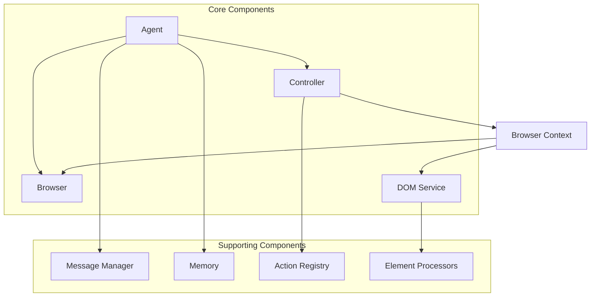

## Under the Hood: How `browser-use` Empowers AI to Navigate the Web

**An in-depth look at the architecture, core components, and Playwright integration powering AI web automation.**

So, you've heard about AI agents browsing the web, performing tasks like booking flights or filling out forms. Ever wondered *how* that actually works? One powerful library enabling this is `browser-use`, an open-source Python project designed to give AI agents robust control over web browsers.

Maybe you've cloned the repo, maybe you're just curious about the mechanics behind AI web automation. This post dives deep into the architecture and core workflows of `browser-use`, explaining *how* it translates high-level AI instructions into concrete browser actions and *why* certain design decisions were made.

We'll assume some familiarity with Python, asynchronous programming (`asyncio`), and basic web concepts.

### TL;DR

`browser-use` acts as a sophisticated bridge between a Large Language Model (LLM) and a web browser. It uses a modular architecture centered around an `Agent` orchestrator, a `Controller` for action execution, a `Browser` abstraction layer over Playwright, and a `DOM Service` for parsing web pages. The Agent takes instructions (often derived from an LLM), uses the Controller to execute specific browser actions (like clicking or typing) via the Browser layer, and gets structured information about the web page state (including a simplified DOM tree) from the DOM Service to inform the next step. This separation of concerns allows for flexibility and robust handling of complex, multi-step web tasks.

### The Core Architecture: Why Modularity Matters

At its heart, `browser-use` is built around a few key components working in concert. Think of it like a specialized team where each member has a distinct role. This modularity isn't just for show; it's crucial for managing the complexity of AI-driven browser interaction. It allows for better separation of concerns, easier testing, and the potential to swap out or extend parts of the system.



*(Diagram adapted from `memory-bank/overview.md`)*

1.  **Agent (`agent/service.py`):** The brain of the operation. It orchestrates the entire task, communicates with the LLM, manages the overall state (`AgentState`), maintains conversation history (potentially using a `Memory` component), and decides what high-level goal to achieve next.
2.  **Controller (`controller/service.py`):** The translator and executor. It takes the Agent's high-level goals (e.g., "click the login button") and translates them into specific, concrete browser commands. It manages a registry (`Action Registry`) of available actions (like `click_element_by_index`, `input_text`, `go_to_url`) and interacts directly with the `Browser` component to perform them.
3.  **Browser (`browser/browser.py` & `browser/context.py`):** The direct interface to the web browser, powered by Playwright. This isn't just a thin wrapper; it provides a crucial abstraction layer. It handles the browser lifecycle (launching, closing), manages contexts and pages, and exposes methods for navigation, state retrieval (`get_state`), and basic operations. Crucially, it interacts with the `DOM Service` to understand the page structure.
4.  **DOM Service (`dom/service.py`):** The page interpreter. Modern web pages are complex. The DOM Service's job is to fetch the page's structure, parse it, and transform it into a simplified, structured representation (`DOMElementNode` tree) that the AI can understand and use. It identifies interactive elements, assigns them indices, and even handles highlighting elements in the browser for debugging or clarity.

Supporting components like the `Message Manager` format communication for the LLM (handling token limits and vision data), while the `Action Registry` dynamically defines and filters the actions available to the agent based on the current browser context.

### Talking to the Browser: The Playwright Abstraction

`browser-use` leverages Playwright for the actual browser automation grunt work. However, you don't typically interact with Playwright directly. Instead, the `Browser` and `BrowserContext` classes provide a higher-level API. *Why this abstraction?* It isolates the rest of the system from the specifics of Playwright, making it potentially easier to adapt to changes or even different automation backends in the future. It also allows `browser-use` to add its own logic for state management, configuration, and DOM processing.

The `Browser` class handles the setup, allowing connection to existing browsers or launching new instances with specific configurations (headless, proxy, security flags, etc.).

```python
# Simplified from browser/browser.py
class Browser:
    # ... (init) ...

    async def new_context(self, config: BrowserContextConfig | None = None) -> BrowserContext:
        # Creates a new browser context (like an isolated session)
        # Merges provided config with defaults
        # Returns a BrowserContext instance
        pass # Implementation details omitted

    async def get_playwright_browser(self) -> PlaywrightBrowser:
        # Lazily initializes Playwright and a browser instance if needed
        if not self.playwright_browser:
            await self._init()
        return self.playwright_browser

    async def _init(self):
        # Handles Playwright startup and browser launch/connection
        # Uses self.config to determine browser type, headless mode etc.
        pass # Implementation details omitted

    async def close(self):
        # Closes the Playwright browser instance
        pass # Implementation details omitted
```

The `BrowserContext` then manages the state of a specific session, including pages/tabs and interacting with the DOM Service.

```python
# Simplified from browser/context.py
class BrowserContext:
    # ... (init) ...

    async def get_state(self, cache_clickable_elements_hashes: bool = False) -> BrowserState:
        # Fetches the current comprehensive state: URL, title, DOM tree,
        # selector map, screenshot (if needed), tabs.
        # Delegates DOM parsing to the DOM Service.
        pass # Implementation details omitted

    async def go_to_url(self, url: str) -> None:
        # Navigates the current page to the specified URL.
        page = await self.get_current_page()
        await page.goto(url) # Example of direct Playwright usage within the abstraction
        # ... (wait logic, error handling) ...

    async def get_dom_element_by_index(self, index: int) -> DOMElementNode:
        # Retrieves the pre-processed DOMElementNode corresponding
        # to the index provided by the DOM Service's mapping.
        selector_map = await self.get_selector_map()
        # ... (lookup and error handling) ...
        return element_node
```

### Making Sense of the Page: The DOM Service

An LLM can't just "look" at a webpage like a human. It needs a structured representation. The `DOM Service` is responsible for creating this. It uses JavaScript injection to execute code directly within the browser page. This script traverses the DOM, identifies potentially interactive elements (buttons, links, inputs), extracts relevant attributes (like text content, `aria-label`), calculates visibility and position, and assigns a unique index to each interactive element.

```python
# Conceptual example based on dom/service.py
class DOMService:
    # ... (init with Playwright Page object, JS code) ...

    async def build_dom_tree(self, highlight_elements: bool = False, ...) -> DOMElementNode:
        # Injects and executes JavaScript in the page context
        js_args = { 'doHighlightElements': highlight_elements, ... }
        raw_dom_data: dict = await self.page.evaluate(self.js_code, js_args)

        # Processes the raw data from JS into a structured
        # DOMElementNode tree and creates the selector map
        # (index -> element node)
        element_tree = self._process_raw_dom(raw_dom_data['tree'])
        self.selector_map = self._create_selector_map(element_tree)

        return element_tree

    # ... (helper methods for processing, creating map) ...
```

*Why JavaScript injection?* It's the most reliable way to get detailed, accurate information about the *rendered* state of the page, including element positions and computed styles, which isn't always available from static HTML source. The resulting `DOMElementNode` tree and the `selector_map` (mapping indices to nodes) are crucial parts of the `BrowserState` sent to the Agent and LLM.

### The LLM Workflow: From State to Action

This is where the AI comes in. The `Agent` coordinates the interaction cycle:

1.  **Get State:** The Agent asks the `BrowserContext` for the current `BrowserState`.
2.  **Format Message:** The `MessageManager` takes this state (URL, simplified DOM, potentially a screenshot if using vision), combines it with task instructions, recent action results (`ActionResult`), and conversation history, and formats it into a prompt suitable for the LLM. This often involves carefully constructing the message content, potentially including the available actions.
    ```python
    # Simplified from agent/message_manager/service.py
    def add_state_message(self, state: BrowserState, ... use_vision: bool):
        if use_vision and state.screenshot:
            # Vision-enabled: Include text description and image data
            text_content = self._build_state_message(state, ...) # Builds text part
            image_content = {"type": "image_url", "image_url": {"url": state.screenshot.b64_image_data, ...}}
            message = HumanMessage(content=[{"type": "text", "text": text_content}, image_content])
        else:
            # Text-only
            message = HumanMessage(content=self._build_state_message(state, ...))
        self._add_message_with_tokens(message) # Manages token budget
    ```
3.  **Invoke LLM:** The Agent sends the formatted messages to the configured LLM. `browser-use` supports different invocation methods, including standard chat completion and specific function/tool calling capabilities offered by models like OpenAI's.
    ```python
    # Simplified from agent/service.py
    async def get_next_action(self, input_messages: list[BaseMessage]) -> AgentOutput:
        # Prepares function/tool definitions if using that method
        if self.tool_calling_method == 'function_calling':
            llm_kwargs = {'functions': self.function_definitions, ...}
            response = await self.llm.ainvoke(input_messages, **llm_kwargs)
            # Process function call response
        else: # Standard invocation
            response = await self.llm.ainvoke(input_messages)
            # Parse action from text response
        # ... (parse LLM output into AgentOutput, handle errors) ...
        return agent_output
    ```
4.  **Execute Action:** The Agent receives the LLM's response (ideally specifying an action like `click_element_by_index` with parameters like `index=5`). It passes this action to the `Controller`.
5.  **Controller Execution:** The `Controller` looks up the action in its registry, validates parameters, and calls the appropriate method on the `BrowserContext` (e.g., `browser._click_element_node(element_node)`).
6.  **Get Result:** The `Controller` receives the outcome (success, failure, error message, extracted data) from the `BrowserContext` and packages it into an `ActionResult`.
7.  **Update State:** The Agent receives the `ActionResult`, updates its internal state (`AgentState`), adds the step to its history, and the loop continues.

This cycle repeats until the task is complete, an error occurs, or a maximum step limit is reached.

It's also worth noting that for complex tasks, `browser-use` doesn't rely solely on a single, upfront plan. As detailed in the `overview.md`, it can incorporate an iterative planning process. Periodically (controlled by configuration like `planner_interval`), a dedicated `PlannerLLM` (or the main LLM) can be invoked using a `PlannerPrompt`. This prompt takes the original goal, history, and current state to generate or refine a multi-step plan. This refined plan is then fed back into the context for the main LLM, allowing the agent to adapt its strategy dynamically based on how the web interaction unfolds.

### Data Flow and State

Keeping track of everything is vital. Key data structures like `AgentState` (tracking steps, history, failures) and `BrowserState` (current URL, title, DOM snapshot, tabs) ensure the agent has the necessary context for each decision. Actions themselves are often represented by dynamically generated Pydantic models (`ActionModel`) based on the registered action's parameters, and their outcomes are captured in an `ActionResult` structure, which feeds back into the Agent's state and history. The flow generally follows: Get `BrowserState` -> Format for LLM -> Get `AgentOutput` (action) -> Execute via `Controller` -> Get `ActionResult` -> Update `AgentState` -> Repeat. *Why is this state management so important?* Web tasks are often sequential; the result of one step directly influences the next. Robust state tracking allows the agent to handle multi-step processes, recover from errors, and maintain context over time.

### Final Words

`browser-use` provides a sophisticated framework for AI-driven web automation. By combining a modular architecture, an abstraction layer over Playwright, intelligent DOM processing, and flexible LLM integration, it enables agents to tackle complex tasks that require understanding and interacting with web interfaces. Understanding its internal workings – the roles of the Agent, Controller, Browser, and DOM Service, its iterative planning capabilities, and how they manage state and interact with the LLM – reveals the intricate mechanisms that allow AI to effectively "use" a browser. The system's design emphasizes good error recovery and state management, making it a robust choice for complex, multi-step web automation scenarios.

### Resources

*   **(Add Link)** `browser-use` GitHub Repository: [Link to the actual repository]
*   Playwright Documentation: [https://playwright.dev/python/docs/intro](https://playwright.dev/python/docs/intro)
*   **(Optional)** LangChain (often used with `browser-use`): [https://python.langchain.com/](https://python.langchain.com/) 