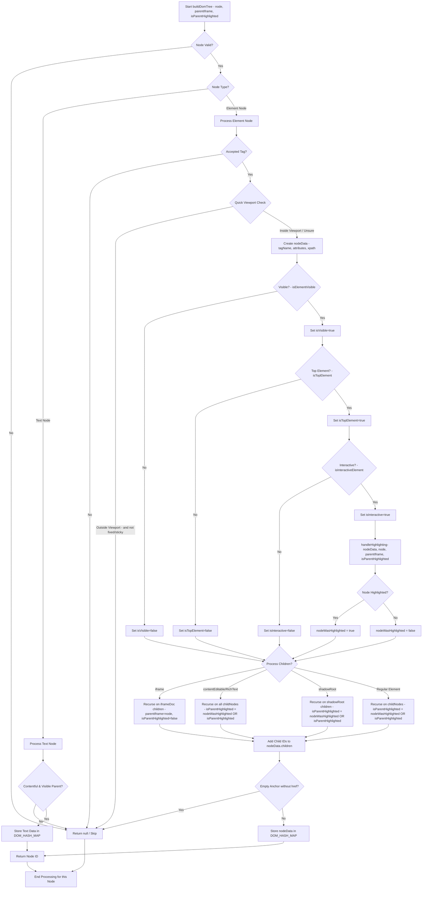

# `buildDomTree.js` Explanation

## 1. Overview and Purpose

The `buildDomTree.js` script is designed to analyze a live HTML Document Object Model (DOM). Its primary functions are:

1.  **Traverse the DOM:** Recursively navigate through the DOM tree, starting from `document.body`.
2.  **Extract Element Information:** For each relevant node, it gathers data such as tag name, attributes, XPath, visibility status, interactivity status, and position.
3.  **Identify Interactive Elements:** It employs a sophisticated set of rules to determine if an element is interactive (e.g., buttons, links, inputs, elements with specific ARIA roles or event listeners).
4.  **Highlight Elements (Optional):** If enabled, it can visually highlight interactive elements on the webpage by drawing overlays and labels. This is useful for debugging and visualization.
5.  **Caching:** It uses a caching mechanism for DOM properties like `getBoundingClientRect()` and `getComputedStyle()` to improve performance during the traversal.
6.  **Performance Metrics (Optional):** In debug mode, it collects detailed performance metrics about the traversal process, DOM operations, and cache usage.

The script outputs a `DOM_HASH_MAP` which is an object where keys are generated IDs and values are objects containing the extracted data for each processed node. It also returns a `rootId` which is the ID corresponding to the `document.body`.

## 2. Core Algorithm: The `buildDomTree` Function

The main logic resides in the `buildDomTree` function (which is also the name of the module's main exported function, and an inner recursive function).

### Initialization:

*   **Arguments:** The main exported function takes an `args` object with options:
    *   `doHighlightElements` (boolean): Whether to draw highlights on interactive elements.
    *   `focusHighlightIndex` (number): If >= 0, only highlights the element with this specific index.
    *   `viewportExpansion` (number): Expands the viewport boundary for visibility checks. "-1" disables viewport checks. (UPDATE: Currently we ignore `isInViewport`)
    *   `debugMode` (boolean): Enables performance metric collection.
*   **Global State:**
    *   `highlightIndex`: Counter for assigning unique indices to highlighted elements.
    *   `PERF_METRICS`: Object to store performance data (if `debugMode` is true).
    *   `DOM_CACHE`: WeakMaps for caching `boundingRects` and `computedStyles`.
    *   `DOM_HASH_MAP`: Stores the processed node data.
    *   `ID`: An object with a `current` property to generate unique IDs for nodes in the map.
    *   `HIGHLIGHT_CONTAINER_ID`: A constant string for the ID of the div that will contain all highlight overlays.

The outer `buildDomTree` function sets up these initial states and then calls an inner, recursive `buildDomTree(node, parentIframe = null, isParentHighlighted = false)` function, starting with `document.body`.

### DOM Traversal and Node Processing:

The inner `buildDomTree` function recursively processes each node:

1.  **Base Cases & Skipped Nodes:**
    *   Returns `null` (skips processing) if:
        *   The node is `null` or is the highlight container itself (`HIGHLIGHT_CONTAINER_ID`).
        *   It's a non-element and non-text node.
        *   It's a text node with no trimmed content or its parent is a `<script>` tag.
        *   It's an element node that doesn't pass `isElementAccepted()` (e.g., `<script>`, `<style>`, `<meta>`).
        *   It's an element node clearly outside the (optionally expanded) viewport based on a quick `getBoundingClientRect()` check (unless `viewportExpansion` is -1 or the element is fixed/sticky).
        *   It's an empty anchor tag `<a>` with no `href` and no children.

2.  **Text Node Processing:**
    *   If it's a text node with content, it creates an entry in `DOM_HASH_MAP` with:
        *   `type: 'TEXT_NODE'`
        *   `text: trimmed text content`
        *   `isVisible: result of isTextNodeVisible(node)`

3.  **Element Node Processing:**
    *   Creates a `nodeData` object with:
        *   `tagName`: Lowercased tag name.
        *   `attributes`: An object of its attributes (collected if `isInteractiveCandidate()` is true or if it's an `<iframe>` or `<body>`).
        *   `xpath`: Generated by `getXPathTree(node, true)`.
        *   `children`: An array to be populated by recursive calls.
    *   **Visibility & Interactivity Checks:**
        *   `nodeData.isVisible = isElementVisible(node)`: Checks if the element has dimensions and is not hidden.
        *   If visible:
            *   `nodeData.isTopElement = isTopElement(node)`: Checks if it's the topmost element at its center point.
            *   If also a top element:
                *   `nodeData.isInteractive = isInteractiveElement(node)`: Determines if the element is interactive.
                *   `nodeWasHighlighted = handleHighlighting(nodeData, node, parentIframe, isParentHighlighted)`: Decides if the element should be highlighted and performs the highlight. This function also sets `nodeData.highlightIndex` and `nodeData.isInViewport`.
    *   **Recursive Calls for Children:**
        *   **Iframes:** If the node is an `<iframe>`, it attempts to access its `contentDocument` and recursively calls `buildDomTree` for children within the iframe. The `parentIframe` argument is set to the current `<iframe>` node, and `isParentHighlighted` is set to `false` (as highlighting resets within an iframe context).
        *   **Rich Text Editors / ContentEditable:** If the node `isContentEditable` or matches patterns for rich text editors (like TinyMCE), it processes all child nodes recursively.
        *   **Shadow DOM:** If `node.shadowRoot` exists, it sets `nodeData.shadowRoot = true` and recursively processes children within the shadow root.
        *   **Regular Elements:** For other elements, it iterates through `node.childNodes` and recursively calls `buildDomTree`. The `isParentHighlighted` argument for the child call becomes `nodeWasHighlighted || isParentHighlighted`, ensuring that children of an already highlighted distinct interactive element are not re-highlighted unless they themselves represent a new distinct interaction.
    *   **Storing Node Data:** A unique ID is generated, and `nodeData` is stored in `DOM_HASH_MAP[id]`. This ID is returned.

### Flowchart of Node Processing:



## 3. Key Functional Areas & Helper Functions

### Visibility and Position Checks

*   `isElementVisible(element)`:
    *   Checks `element.offsetWidth > 0 && element.offsetHeight > 0`.
    *   Checks `computedStyle.visibility !== 'hidden'` and `computedStyle.display !== 'none'`.
    *   Uses cached computed styles.
*   `isTextNodeVisible(textNode)`:
    *   Creates a `Range` for the text node and checks `range.getClientRects()`.
    *   Ensures at least one rect has `width > 0` and `height > 0` and is within the (expanded) viewport.
    *   Checks parent element's visibility using `checkVisibility()` or fallback style checks (`display`, `visibility`, `opacity`).
*   `isInExpandedViewport(element, viewportExpansion)`:
    *   Returns `true` if `viewportExpansion === -1` (viewport check disabled).
    *   Uses `element.getClientRects()`. If empty, falls back to `getCachedBoundingRect(element)`.
    *   Checks if *any* client rect (with `width > 0` and `height > 0`) intersects with the viewport, expanded by `viewportExpansion` pixels on all sides.
*   `isTopElement(element)`:
    *   Uses `element.getClientRects()`. Returns `false` if no rects or all rects are outside the (expanded) viewport.
    *   If the element is in an iframe (`element.ownerDocument !== window.document`), it's considered top by default within that iframe's context.
    *   For elements in the main document or shadow DOM:
        *   Calculates the center point of the middle client rect.
        *   Uses `shadowRoot.elementFromPoint(centerX, centerY)` or `document.elementFromPoint(centerX, centerY)`.
        *   Traverses up from the element found at that point to see if the original `element` is an ancestor or the element itself. This determines if the original `element` is effectively the topmost one at that coordinate.

### Interactivity Detection

*   `isInteractiveCandidate(element)`:
    *   A quick preliminary check to see if an element *might* be interactive.
    *   Checks common interactive tag names (`<a>`, `<button>`, `<input>`, etc.).
    *   Checks for presence of attributes like `onclick`, `role`, `tabindex`, `aria-*`, `data-action`, or `contenteditable="true"`.
*   `isInteractiveElement(element)`:
    *   The main function to determine if an element is interactive.
    *   **Cursor Style:** Checks `computedStyle.cursor` against a list of known interactive cursors (e.g., `pointer`, `text`, `grab`) and non-interactive cursors (e.g., `not-allowed`, `wait`). This is a primary and effective check.
    *   **Tag Name:** Checks against a set of inherently interactive tag names (`<a>`, `<button>`, `<input>`, `<select>`, `<textarea>`, `details`, `summary`, `label`, `option`).
        *   For these tags, it also checks for disabling conditions:
            *   Non-interactive cursor style.
            *   Presence of `disabled`, `readonly` attributes.
            *   `element.disabled`, `element.readOnly`, `element.inert` properties.
    *   **ARIA Roles:** Checks `element.getAttribute('role')` against a set of interactive roles (e.g., `button`, `menuitem`, `radio`, `checkbox`, `tab`).
    *   **Class/Attribute Patterns:** Checks for specific class names (`button`, `dropdown-toggle`) or attributes (`data-index`, `data-toggle="dropdown"`, `aria-haspopup="true"`) often associated with interactive components.
    *   **Event Listeners:**
        *   If `getEventListeners` (a DevTools utility, may not be available in all contexts) is available, it checks for common mouse event listeners (`click`, `mousedown`, etc.).
        *   Fallback: Checks for common event attributes (`onclick`, `onmousedown`, etc.).
*   `isElementDistinctInteraction(element)`:
    *   Determines if an *already interactive* element represents a distinct interaction from its parent (if the parent is also interactive and was highlighted). This prevents highlighting nested elements that trigger the same action (e.g., a `<span>` inside a `<button>`).
    *   Returns `true` (distinct) if:
        *   It's an `<iframe>`.
        *   Its tag name is in `DISTINCT_INTERACTIVE_TAGS` (e.g., `<a>`, `<button>`, `<input>`).
        *   Its ARIA `role` is in `INTERACTIVE_ROLES`.
        *   It's `contentEditable`.
        *   It has testing attributes like `data-testid`.
        *   It has an `onclick` attribute or property.
        *   It has other common interaction event listeners (`mousedown`, `keydown`, `submit`, `change`, etc.), checked via `getEventListeners` or attribute fallbacks.

### Element Highlighting

*   `handleHighlighting(nodeData, node, parentIframe, isParentHighlighted)`:
    *   Called only if `nodeData.isInteractive` is true.
    *   Decides if highlighting should occur:
        *   If `isParentHighlighted` is false, this interactive node can be highlighted.
        *   If `isParentHighlighted` is true, this node is only highlighted if `isElementDistinctInteraction(node)` is true.
    *   If it should highlight:
        *   Sets `nodeData.isInViewport = isInExpandedViewport(node, viewportExpansion)`.
        *   If in viewport:
            *   Assigns `nodeData.highlightIndex = highlightIndex++`.
            *   If `doHighlightElements` is true:
                *   Calls `highlightElement(node, nodeData.highlightIndex, parentIframe)` either for all elements or only if `focusHighlightIndex` matches.
            *   Returns `true` (highlighted).
    *   Returns `false` if not highlighted.
*   `highlightElement(element, index, parentIframe = null)`:
    *   Responsible for drawing the visual highlight on the page.
    *   Creates or reuses a main container div (`#playwright-highlight-container`) appended to `document.body` to hold all overlays and labels. This container is fixed and covers the viewport.
    *   Uses `element.getClientRects()` to get all rectangles for the element (handles multi-line elements).
    *   For each client rect (if `width > 0` and `height > 0`):
        *   Creates an overlay `<div>`.
        *   Styles it with a border color (cycled from a predefined list based on `index`) and a semi-transparent background.
        *   Positions and sizes it based on the rect, adjusting for `parentIframe` offset if present.
        *   Appends it to the highlight container.
    *   Creates a single label `<div>` for the element:
        *   Styles it with the same base color, white text, padding, and border-radius.
        *   Sets its text content to `index`.
        *   Calculates its position relative to the first client rect, attempting to place it at the top-right corner of the element, with adjustments to keep it within the viewport and visible if the element is small.
        *   Appends it to the highlight container.
    *   **Dynamic Updates:** Adds `scroll` (capture phase) and `resize` event listeners to the window. The `updatePositions` handler re-fetches `element.getClientRects()` and the parent iframe's rect (if any) to reposition all overlays and the label, ensuring they stay aligned with the element as the page scrolls or resizes. It also hides/shows overlays if the number of client rects changes or if they become zero-sized.
    *   **TODO:** Mentions a `TODO` for cleanup logic to remove listeners and elements, which is important for long-lived applications or single-page apps.

### XPath Generation

*   `getXPathTree(element, stopAtBoundary = true)`:
    *   Generates a simplified XPath-like string for an element.
    *   Traverses up the DOM from `currentElement` to its parent.
    *   For each element in the path, it determines its tag name and its 1-based position among siblings of the same tag name (e.g., `div[2]`). If it's the only sibling of that type, no index is added.
    *   Segments are joined with `/`.
    *   If `stopAtBoundary` is true (default), it stops traversing if it encounters a `ShadowRoot` or an `HTMLIFrameElement` as a parent, meaning the XPath is relative to that boundary.

### Caching Mechanism

*   `DOM_CACHE`: An object with:
    *   `boundingRects`: A `WeakMap` to store `element.getBoundingClientRect()` results.
    *   `computedStyles`: A `WeakMap` to store `window.getComputedStyle(element)` results.
    *   `clearCache()`: A function to clear both WeakMaps (called before the main traversal starts).
*   `getCachedBoundingRect(element)`:
    *   If `DOM_CACHE.boundingRects` has the `element`, returns the cached rect and increments `boundingRectCacheHits` (in debug mode).
    *   Otherwise, calls `element.getBoundingClientRect()`, stores the result in the cache, increments `boundingRectCacheMisses`, and tracks the operation's time (in debug mode).
*   `getCachedComputedStyle(element)`:
    *   Similar to `getCachedBoundingRect`, but for `window.getComputedStyle(element)`.

## 4. Performance Metrics (`PERF_METRICS`)

When `debugMode` is `true`, the script collects detailed performance metrics in the `PERF_METRICS` object.

*   **`timings`**: Stores total time spent in key functions (e.g., `highlightElement`, `isInteractiveElement`). (Note: the `measureTime` wrapper seems to have its timing accumulation commented out, but `measureDomOperation` is active).
*   **`cacheMetrics`**:
    *   `boundingRectCacheHits`, `boundingRectCacheMisses`
    *   `computedStyleCacheHits`, `computedStyleCacheMisses`
    *   Calculated `boundingRectHitRate`, `computedStyleHitRate`, `overallHitRate`.
*   **`nodeMetrics`**:
    *   `totalNodes`: Total nodes encountered.
    *   `processedNodes`: Nodes that were actually processed and added to the map.
    *   `skippedNodes`: Nodes that were skipped due to various criteria.
*   **`buildDomTreeBreakdown`**: (This seems to be where most DOM operation timing is aggregated via `measureDomOperation`)
    *   `domOperations`: Total time spent in specific DOM calls like `getBoundingClientRect`, `getComputedStyle`.
    *   `domOperationCounts`: Number of times these DOM calls were made.
    *   Calculated average times for these operations.

The `measureDomOperation(operation, name)` helper function is used to wrap critical DOM calls (like `element.getBoundingClientRect()`, `window.getComputedStyle()`, `elementFromPoint()`). It measures the duration of the operation and aggregates it into `PERF_METRICS.buildDomTreeBreakdown.domOperations` and updates the counts.

The `measureTime(fn)` wrapper was intended for broader function timing but appears to be partially disabled in the provided code.

## 5. Output Structure

The main `buildDomTree` function returns an object:

*   **`rootId`**: A string representing the unique ID assigned to the `document.body` element. This is the entry point into the `DOM_HASH_MAP`.
*   **`map`**: This is the `DOM_HASH_MAP`. It's an object where:
    *   Keys are unique string IDs generated for each processed node.
    *   Values are "nodeData" objects containing the extracted information for that node (e.g., `tagName`, `attributes`, `xpath`, `children` (array of child IDs), `isVisible`, `isInteractive`, `highlightIndex`, etc., or `type: 'TEXT_NODE'`, `text` for text nodes).
*   **`perfMetrics` (if `debugMode` is true)**: The `PERF_METRICS` object containing all collected performance data, with times converted to seconds and some derived metrics calculated.

Example `nodeData` for an element in the `map`:
```javascript
// Example ID: "123"
// DOM_HASH_MAP["123"] might look like:
{
  tagName: "button",
  attributes: { id: "submit-btn", class: "btn primary" },
  xpath: "body[1]/main[1]/div[2]/button[1]",
  children: ["124", "125"], // IDs of child nodes in the map
  isVisible: true,
  isTopElement: true,
  isInteractive: true,
  isInViewport: true,
  highlightIndex: 5 
}
```

Example for a text node:
```javascript
// Example ID: "124"
// DOM_HASH_MAP["124"] might look like:
{
  type: "TEXT_NODE",
  text: "Submit Form",
  isVisible: true
}
```

## 6. Configuration Arguments

The behavior of `buildDomTree` can be controlled by the arguments passed to the main exported function:

*   `doHighlightElements: boolean` (default: `true`)
    *   If `true`, interactive elements that are deemed highlightable will have visual overlays and labels drawn on them.
    *   If `false`, no visual highlighting occurs, but `highlightIndex` might still be assigned to `nodeData` if the element would have been highlighted.
*   `focusHighlightIndex: number` (default: `-1`)
    *   If `doHighlightElements` is `true` and `focusHighlightIndex` is a non-negative number, only the interactive element whose assigned `highlightIndex` matches this value will be visually highlighted.
    *   If `-1`, all highlightable interactive elements are highlighted.
*   `viewportExpansion: number` (default: `0`)
    *   A value in pixels used to expand the effective viewport for visibility checks (`isInExpandedViewport`, `isTopElement`). Positive values make the "visible" area larger.
    *   If `-1`, viewport checks based on this expansion are effectively disabled (elements are considered in viewport for these specific checks). This is useful if you want to capture all elements regardless of their current scroll position.
    *   Note: Even with `viewportExpansion: -1`, basic visibility (`element.offsetWidth > 0`, etc.) and `display: none` checks still apply.
*   `debugMode: boolean` (default: `false`)
    *   If `true`, enables the collection of performance metrics in `PERF_METRICS`. The returned object will include a `perfMetrics` property.
    *   If `false`, performance metrics are not collected, and the `perfMetrics` property will not be part of the return value.

This script provides a powerful way to snapshot and understand the state of a webpage's DOM, especially focusing on user-interactable parts. 