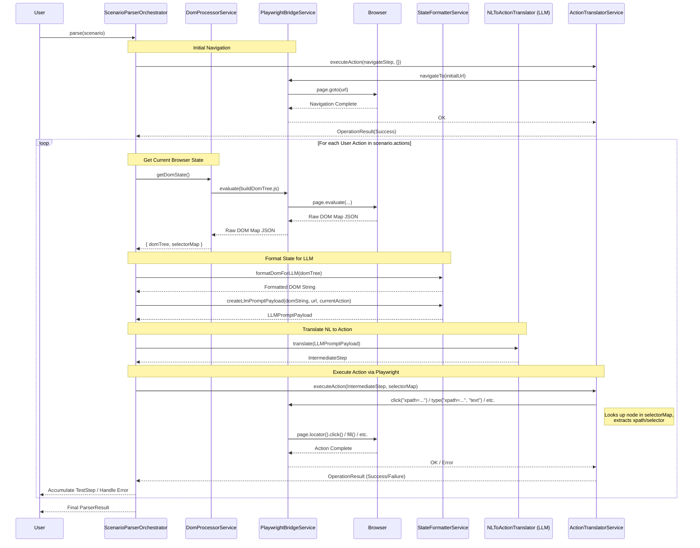

# Scenario Parser - Direct Playwright Integration Plan

**Version:** 1.0
**Date:** [Current Date]

## 1. Goal

Adapt the core logic of the `browser-use` Python package (DOM extraction, state formatting, action execution via direct Playwright) into the TypeScript `scenario-parser` module for the MVP, replacing the previously planned MCP-based approach. This leverages existing, proven patterns for LLM-driven browser interaction while providing greater flexibility and control.

## 2. High-Level Interaction Flow

This sequence diagram illustrates the flow for parsing a scenario using the direct Playwright approach:



## 3. Phase 1: Analysis and Mapping (Completed)

This phase involved analyzing the `browser-use` codebase (`DomService`, `buildDomTree.js`, `MessageManager`, `Controller`, `BrowserContext`, `DOMElementNode`) and the `article2-eyes-and-hands-of-browser-use.md` document.

**Key Findings:**

*   **DOM Extraction:** `buildDomTree.js` (run via `page.evaluate`) captures DOM structure, visibility, interactivity, and assigns `highlightIndex`. `DomService` (Python) processes this into a `DOMElementNode` tree and creates a `selectorMap` (index -> node).
*   **State Formatting:** `MessageManager` uses the `DOMElementNode` tree (potentially via its methods like `clickable_elements_to_string`) to create a text representation for the LLM, including the `highlightIndex`.
*   **Action Execution:** `Controller` receives LLM actions (referencing `highlightIndex`), uses the `selectorMap` via `BrowserContext` to find the target `DOMElementNode`, extracts selectors (XPath/CSS), and instructs `BrowserContext` to execute low-level Playwright commands (`page.locator().click()`, etc.).

## 4. Phase 2: Planning the Conversion & Integration

This phase outlines the implementation steps for the TypeScript `scenario-parser`.

### 4.1. Component Design & Interface Refinement

New/adapted TypeScript services within `src/scenario-parser/components/`:

*   **`PlaywrightBridgeService` (`components/playwright-bridge/playwright-bridge.service.ts`)**
    *   **Responsibility:** Manages Playwright `BrowserContext` and `Page`, executes low-level browser operations. Connects to Playwright instance.
    *   **Key Methods (Illustrative):**
        ```typescript
        constructor(config: PlaywrightConfig);
        async getPage(): Promise<Page>;
        async navigateTo(url: string): Promise<void>;
        async goBack(): Promise<void>;
        async getCurrentUrl(): Promise<string>;
        async getPageContent(): Promise<string>;
        async evaluate<R>(script: string | Function, args?: any): Promise<R>;
        async click(selector: string): Promise<void>;
        async type(selector: string, text: string): Promise<void>;
        async selectOption(selector: string, value: string | string[]): Promise<void>;
        async scrollIntoView(selector: string): Promise<void>;
        async waitForLoadState(state?: 'load' | 'domcontentloaded' | 'networkidle', options?: { timeout?: number }): Promise<void>;
        async getTabsInfo(): Promise<TabInfo[]>; // Define TabInfo interface
        async switchToTab(pageIndex: number): Promise<void>;
        async close(): Promise<void>;
        ```
    *   **Dependencies:** `playwright` library, Configuration.

*   **`DomProcessorService` (`components/dom-processor/dom-processor.service.ts`)**
    *   **Responsibility:** Orchestrates DOM snapshotting via `buildDomTree.js`, parses the result, builds the `SerializableDOMNode` tree, and creates the `SelectorMap`.
    *   **Key Methods (Illustrative):**
        ```typescript
        constructor(playwrightBridge: PlaywrightBridgeService);
        async getDomState(): Promise<{ domTree: SerializableDOMNode, selectorMap: SelectorMap }>;
        // Internal helpers for parsing JS map and building TS tree/map
        ```
    *   **Dependencies:** `PlaywrightBridgeService`, `buildDomTree.js` file content.

*   **`StateFormatterService` (`components/state-formatter/state-formatter.service.ts`)**
    *   **Responsibility:** Converts the `SerializableDOMNode` tree into a string format for the LLM prompt.
    *   **Key Methods (Illustrative):**
        ```typescript
        formatDomForLLM(domTree: SerializableDOMNode, includeAttributes: string[]): string;
        createLlmPromptPayload(domString: string, currentUrl: string, userAction: string, /*...*/): LLMPromptPayload; // Define LLMPromptPayload
        ```
    *   **Dependencies:** Configuration (optional).

*   **`ActionTranslatorService` (`components/action-translator/action-translator.service.ts`)**
    *   **Responsibility:** Maps `IntermediateStep` to specific calls on `PlaywrightBridgeService`.
    *   **Key Methods (Illustrative):**
        ```typescript
        constructor(playwrightBridge: PlaywrightBridgeService);
        async executeAction(intermediateStep: IntermediateStep, selectorMap: SelectorMap): Promise<OperationResult>;
        // Internal helper to get selector from node
        ```
    *   **Dependencies:** `PlaywrightBridgeService`.

*   **Updated Interfaces (`interfaces/internal.types.ts`, `interfaces/common.types.ts`)**
    *   **`SerializableDOMNode`**:
        *   Add: `xpath: string`, `isInteractive: boolean`, `highlightIndex?: number`.
        *   Ensure `parent?: SerializableDOMNode` and `children: SerializableDOMNode[]` are correctly typed.
        *   Consider adding `isTopElement?: boolean`, `isInViewport?: boolean` if needed by formatting/logic.
    *   **`SelectorMap`**: `export type SelectorMap = Record<number, SerializableDOMNode>;`
    *   **`BrowserStepContext`**: Update to include `domTree: SerializableDOMNode`, `selectorMap: SelectorMap`, `currentURL: string`.
    *   **`TabInfo`**: Define structure (e.g., `{ pageIndex: number; url: string; title: string; }`).
    *   **`OperationResult` / `ErrorInfo`**: Ensure they can capture Playwright-specific errors (timeouts, selector issues).
    *   Remove/deprecate `mcp.types.ts`.

### 4.2. `buildDomTree.js` Translation Plan

*   **Assessment:** The script uses standard browser APIs and should be directly usable via `page.evaluate`. No translation is expected to be necessary.
*   **Loading:** `DomProcessorService` will read the script's content from the file system (`fs.readFileSync`) during initialization or on demand.

### 4.3. Python -> TypeScript Logic Translation Plan

*   **`DomProcessorService` (`getDomState`):**
    *   Implement the iteration over the JSON map returned by `buildDomTree.js`.
    *   Create `SerializableDOMNode` instances, mapping fields directly (tagName, xpath, attributes, isVisible, isInteractive, highlightIndex).
    *   Implement the two-pass logic (create all nodes first, then link parents/children) or use a recursive approach with careful handling of references.
    *   Populate the `SelectorMap` dictionary during node creation if `highlightIndex` is present.
*   **`StateFormatterService` (`formatDomForLLM`):**
    *   Implement a recursive TypeScript function to traverse the `SerializableDOMNode` tree.
    *   Replicate the formatting logic from `DOMElementNode.clickable_elements_to_string`:
        *   Indent based on depth.
        *   For interactive nodes, include `highlightIndex` (e.g., `[index]`).
        *   Aggregate relevant text content from children text nodes until the next interactive element is encountered.
        *   Optionally include specified attributes (`id`, `class`, `role`, `aria-label`, etc.).
        *   Concatenate into a multi-line string.
*   **`PlaywrightBridgeService` (Methods):**
    *   Use the `playwright` npm package (e.g., `import { chromium, Page, BrowserContext as PWContext } from 'playwright';`).
    *   Implement methods using the async API (e.g., `await page.goto(url)`, `await page.locator(selector).click()`, `await page.evaluate(script)`).
    *   Wrap calls in `try...catch` blocks, translating Playwright errors (`TimeoutError`, etc.) into `OperationResult` or throwing custom exceptions.
    *   Translate Python `asyncio` waiting logic (`_wait_for_page_and_frames_load`, `_wait_for_stable_network`) using appropriate TypeScript async patterns (e.g., `await new Promise(resolve => setTimeout(resolve, ms))`, loops checking conditions).
*   **`ActionTranslatorService` (`executeAction`):**
    *   Use a `switch` statement on `intermediateStep.actionType`.
    *   For targeted actions (`click`, `input`, `select`):
        *   Get `highlightIndex` from `intermediateStep.targetSelector`.
        *   Look up the node in `selectorMap[highlightIndex]`.
        *   If found, retrieve `node.xpath`.
        *   Generate a selector string suitable for Playwright (e.g., `xpath=${node.xpath}`). Consider generating CSS selector as fallback if needed.
        *   Call the corresponding `PlaywrightBridgeService` method (e.g., `this.playwrightBridge.click(\`xpath=\${xpath}\`)`).
    *   For navigation: Call `this.playwrightBridge.navigateTo(intermediateStep.url)`.
    *   Handle errors (e.g., index not in map, selector not found by Playwright) and populate `OperationResult.error`.

### 4.4. Tech Spec (`scenario-parser-tech-spec.md`) Update Plan

*   **Architecture Diagram:** Replace MCP diagram with one showing Orchestrator interacting with `NLToActionTranslator`, `StateFormatterService`, `ActionTranslatorService`, `DomProcessorService`, and `PlaywrightBridgeService`, with the latter interacting with the Playwright Browser.
*   **File Structure:** Add new component directories.
*   **Component Descriptions:** Replace MCP component descriptions with detailed descriptions of the new TypeScript services. Update `Orchestrator` description.
*   **Key Interfaces:** Reflect updated/new interfaces (`SerializableDOMNode`, `SelectorMap`, `TabInfo`, etc.). Remove `mcp.types.ts`.
*   **Core Function Signatures:** Update to match new service methods.
*   **High-Level Flow:** Rewrite section 8 and 8.1 to describe the direct Playwright cycle.

### 4.5. Identify Libraries

*   **Required:** `playwright` (npm)
*   **Potential:** `uuid` (npm) - If needed.
*   **Built-in:** Node.js `fs` (for reading JS file). 