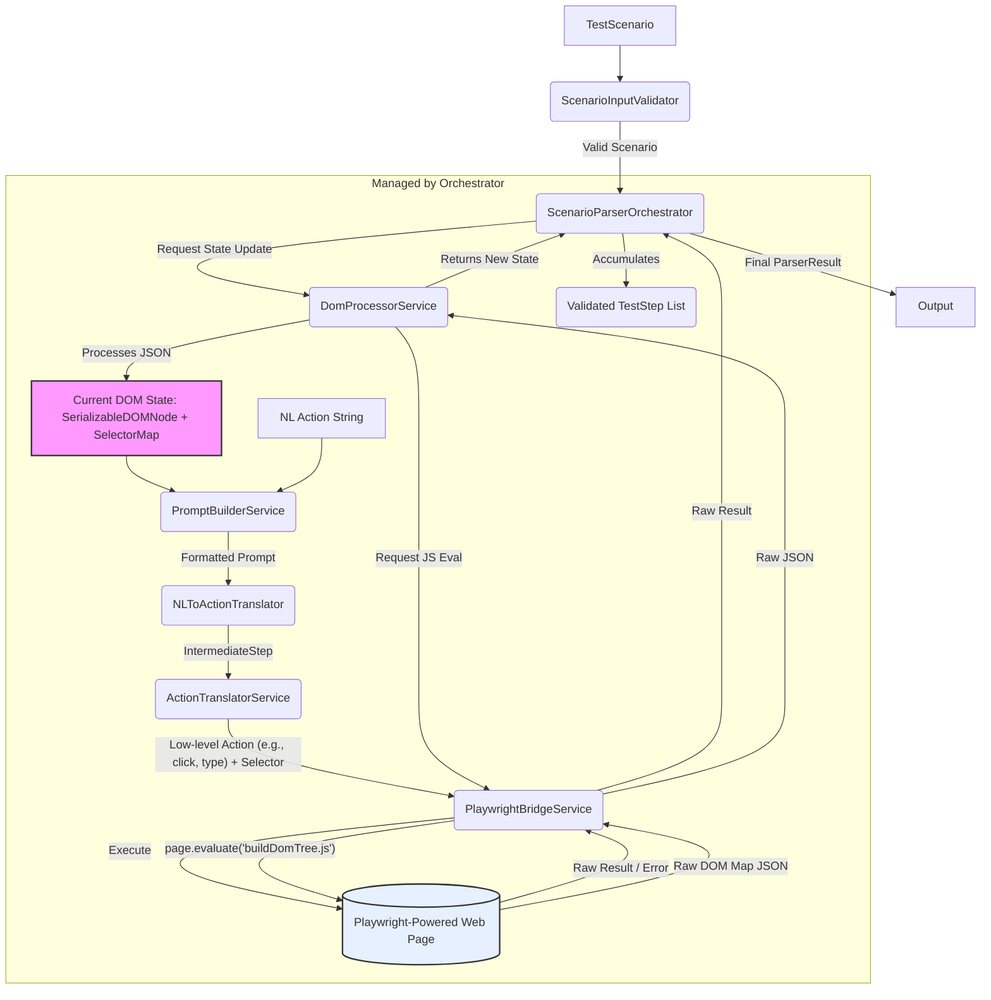
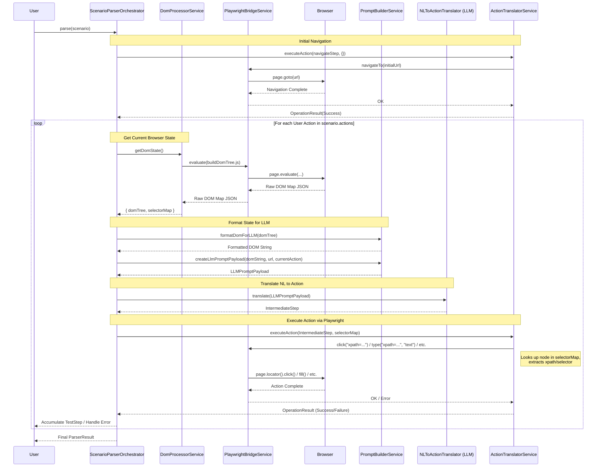

# Scenario Parser Module - Technical Specification

**Version:** 1.1 (Direct Playwright)
**Date:** [Current Date]

## 1. Overview

The `scenario-parser` module is responsible for translating a human-readable test scenario (URL + sequence of natural language actions) into a structured sequence of validated `TestStep` objects. It interacts directly with a **Playwright** browser instance to execute actions, uses an LLM (via function calling) to interpret natural language actions within the browser context captured by Playwright, and constructs the final steps based on successful execution.

## 2. Goals

*   Accept a `TestScenario` object as input.
*   **Interact directly and sequentially with a Playwright `Page` instance to perform actions.**
*   Utilize an LLM (via function calling) to interpret natural language actions based on **structured DOM context** provided by a custom Playwright evaluation script.
*   **Filter and serialize the DOM context effectively for the LLM using a structure inspired by `browser-use`.**
*   Generate a list of validated `TestStep` objects for successfully executed actions.
*   Handle errors gracefully during the process.
*   Focus on core actions: `navigate`, `click`, `input`, `assert`.

## 3. Architecture (Direct Playwright)

The module follows a sequential, stateful processing model orchestrated by `ScenarioParserOrchestrator`. Each user action is processed individually, relying on the browser state resulting from the previous action, managed via direct Playwright interactions.



**Interaction Flow (Simplified):**



## 4. File Structure (Revised)

```
src/
├── scenario-parser/
│   ├── scenario-parser.service.ts       # Orchestrator - Main logic
│   ├── orchestrator-helpers.ts          # Optional: Helpers for the orchestrator
│   ├── components/                      # Directory for component modules
│   │   ├── validator/
│   │   │   ├── index.ts
│   │   │   └── validator.logic.ts
│   │   ├── playwright-bridge/           # << Manages Playwright interactions
│   │   │   ├── index.ts
│   │   │   └── playwright-bridge.service.ts
│   │   ├── dom-processor/               # << Processes DOM state from Playwright
│   │   │   ├── index.ts
│   │   │   ├── dom-processor.service.ts # Main logic
│   │   │   └── buildDomTree.js          # << JS script for page.evaluate (from browser-use)
│   │   ├── prompt-builder/             # << Formats DOM for LLM
│   │   │   ├── index.ts
│   │   │   └── prompt-builder.service.ts
│   │   ├── nl-translator/               # << (Existing) NL -> IntermediateStep
│   │   │   ├── index.ts
│   │   │   └── nl-translator.logic.ts
│   │   ├── action-translator/           # << IntermediateStep -> Playwright calls
│   │   │   ├── index.ts
│   │   │   └── action-translator.service.ts
│   │   └── prompt-formatter/            # << DEPRECATED / REPLACED by prompt-builder
│   │       └── ...
│   │   └── result-processor/            # << DEPRECATED / REPLACED by dom-processor + orchestrator logic
│   │       └── ...
│   │   └── command-generator/           # << DEPRECATED / REPLACED by action-translator
│   │       └── ...
│   │   └── mcp-client/                  # << DEPRECATED / REPLACED by playwright-bridge
│   │       └── ...
│   ├── interfaces/                      # Shared interfaces
│   │   ├── common.types.ts
│   │   ├── internal.types.ts            # << Includes SerializableDOMNode, SelectorMap
│   │   ├── scenario.types.ts
│   │   ├── test-step.types.ts
│   │   └── playwright.types.ts          # << (Optional) Specific types for Playwright interactions
│   ├── utils/                           # Shared utilities
│   │   └── index.ts
│   ├── tests/                           # Test structure mirrors components/
│   │   └── ...
│   ├── README.md
│   ├── scenario-parser-tech-spec.md     # This file
│   └── scenario-parser-direct-playwright-plan.md # << Detailed implementation plan
├── ... (Other top-level src modules)
```

## 5. Component Descriptions (Revised)

*   **`ScenarioInputValidator` (`components/validator/validator.logic.ts`):** (Unchanged) Validates the input `TestScenario`.
*   **`PlaywrightBridgeService` (`components/playwright-bridge/playwright-bridge.service.ts`):** Manages the connection to the Playwright Browser instance and the active `Page`. Executes low-level Playwright commands (navigate, click, type, evaluate JS, etc.) based on instructions from the `ActionTranslatorService`. Handles basic page waits.
*   **`DomProcessorService` (`components/dom-processor/dom-processor.service.ts`):** Orchestrates the capturing of the browser's current DOM state. It uses the `PlaywrightBridgeService` to execute the `buildDomTree.js` script (inspired by `browser-use`) within the page context. It parses the resulting JSON data, builds a structured tree representation (`SerializableDOMNode`), and creates a `SelectorMap` mapping interaction indices to nodes.
*   **`PromptBuilderService` (`components/prompt-builder/prompt-builder.service.ts`):** Takes the structured DOM tree (`SerializableDOMNode`) from the `DomProcessorService`. Formats this tree into a concise string representation suitable for the LLM prompt, highlighting interactive elements and their indices. Combines this with other context (URL, user action) to create the final payload for the `NLToActionTranslator`. It prioritizes elements that are visible, interactive, and top-most (`isTopElement: true`), assigning them indices and formatting them clearly for the LLM, while generally omitting or de-emphasizing obscured interactive elements (`isTopElement: false`) to reduce noise and improve action accuracy.
*   **`NLToActionTranslator` (`components/nl-translator/nl-translator.logic.ts`):** Receives the formatted prompt payload. Manages the LLM API call, expecting an `IntermediateStep` function call representing the LLM's interpretation of the user action within the given DOM context. Parses the response.
*   **`ActionTranslatorService` (`components/action-translator/action-translator.service.ts`):** Receives the `IntermediateStep` from the `NLToActionTranslator`. If the action requires interacting with an element, it uses the `highlightIndex` from the `IntermediateStep` and the `SelectorMap` (provided by the `Orchestrator` from the `DomProcessorService`) to identify the target `SerializableDOMNode`. It extracts a stable selector (e.g., XPath) from the node and instructs the `PlaywrightBridgeService` to perform the corresponding low-level Playwright action (e.g., `click(selector)`, `type(selector, value)`). Handles navigation actions directly.
*   **`ScenarioParserOrchestrator` (`scenario-parser.service.ts`):** The main service. Manages the overall step-by-step flow. Coordinates calls to other components: validates input, requests state from `DomProcessorService`, formats prompt via `PromptBuilderService`, gets `IntermediateStep` from `NLToActionTranslator`, executes action via `ActionTranslatorService`. It accumulates successful `TestStep` objects and handles errors, producing the final `ParserResult`.

## 6. Key Interfaces (Revised)

*(Located in `src/interfaces/`)*

**`common.types.ts`** (Largely Unchanged, `mcpCommand` -> `playwrightAction`?)

```typescript
export interface ErrorInfo {
  stepId?: string;
  message: string;
  action?: string;
  playwrightAction?: string; // Playwright action that failed (if applicable)
  llmError?: string;
  selector?: string; // Selector involved (if known)
  // Removed MCP-specific fields, Playwright errors might be captured in message/stack
  stack?: string;
}

export interface OperationResult {
  success: boolean;
  executionTimeMs?: number;
  error?: ErrorInfo;
  // Optional: Add field for extracted content from actions like 'extract_content'
  extractedContent?: string;
}
```

**`scenario.types.ts`** (Unchanged)

```typescript
import { TestStep } from './test-step.types';
import { ErrorInfo, OperationResult } from './common.types';

export interface TestScenario {
  url: string; // Initial URL to navigate to
  actions: string[]; // List of user's natural language actions
  options?: {
    timeoutMs?: number; // Overall timeout for parsing
    // TBD: Other potential options?
  };
}

export interface ParserResult extends OperationResult {
  testSteps: TestStep[]; // The successfully generated steps
  status: 'success' | 'partial' | 'failed'; // Overall outcome
  errors?: ErrorInfo[]; // Accumulated errors if status is not 'success'
}
```

**`test-step.types.ts`** (Context updated)

```typescript
export type TestStepAction = 'navigate' | 'input' | 'click' | 'assert' /* | ... MVP focus */;

export interface TestStepContext {
  // Replacing mcpSnapshot with more relevant context
  domStructureSnapshot: string; // The formatted DOM string provided to the LLM for this step
  fullDomSnapshot?: any; // Optional: Raw JSON/object from buildDomTree.js for debugging
  // TBD: Other context? Playwright logs? Error details?
}

export interface TestStep {
  id: string; // Unique identifier (e.g., uuid)
  description: string; // Original user natural language action string
  action: TestStepAction;
  selector?: string; // The specific selector validated and used by MCP
  value?: string | number | boolean; // Value for 'input' or 'assert' actions
  url?: string; // URL for 'navigate' action
  context: TestStepContext; // Snapshot and potentially other data from MCP execution
  // Optional fields for post-MVP:
  // timeout?: number; // Step-specific timeout
  // waitFor?: 'visible' | 'networkidle' | 'domcontentloaded' | 'load';
  // isLastStep?: boolean; // Might be handled by Orchestrator logic
  // maxRetries?: number; // Step-level retries (distinct from MCPClient retries)
}

```

**`mcp.types.ts`** -> **REMOVED** (Or potentially replaced by `playwright.types.ts` if complex specific types are needed, but likely unnecessary for now).

**`internal.types.ts`** (Significant Updates)

```typescript
import { TestStepAction, OperationResult } from "."; // Assuming barrel file exports these

// Represents the structured hypothesis from the LLM via function calling
export interface IntermediateStep {
  actionType: TestStepAction | 'unknown' | 'navigate'; // Added navigate explicitly
  targetSelector?: string; // Identifier for target element (e.g., `highlightIndex=5`)
  inputValue?: string | number | boolean;
  url?: string; // URL for navigate action
  description: string;
  isAmbiguous?: boolean;
  confidenceScore?: number;
  error?: string;
}

// Represents a node in the filtered, serializable DOM tree passed to the LLM
// Enhanced based on browser-use DOMElementNode
export interface SerializableDOMNode {
  tag: string;
  attributes: Record<string, string>; // Relevant attributes (id, class, data-*, aria-*, role, type, placeholder, value, etc.)
  text?: string; // Combined/truncated text content of non-element children
  xpath: string; // XPath selector relative to document or frame/shadow root
  children: SerializableDOMNode[];
  parent?: SerializableDOMNode; // Reference to parent node

  // Properties determined by buildDomTree.js & DomProcessorService
  isVisible: boolean;
  isInteractive: boolean;
  highlightIndex?: number; // Unique index for interactive elements
  isTopElement?: boolean; // Indicates if this element is the effective top-most element at its coordinates, considering potential overlaps (z-index). True if it would receive pointer events (like clicks) at its location, determined using browser checks like `elementFromPoint`. Crucial for identifying truly interactable elements.
  isInViewport?: boolean; // Is it within the (expanded) viewport?
  shadowRoot?: boolean; // Does it host a shadow root?
  isNew?: boolean; // Was this element newly detected compared to the previous step? (Optional optimization)

  // Note: toString() method removed, formatting handled by PromptBuilderService
}

// Type for the mapping from highlight index to the node object
export type SelectorMap = Record<number, SerializableDOMNode>;

// Context passed between Orchestrator and services during a step
export interface BrowserStepContext {
  domTree: SerializableDOMNode; // The structured DOM tree
  selectorMap: SelectorMap;     // Map from highlight index to node
  currentURL: string;
  previousStepResult?: OperationResult;
}

// (Optional) Define TabInfo if needed by state/prompt formatting
export interface TabInfo {
  pageIndex: number;
  url: string;
  title: string;
}
```

## 7. Core Function Signatures (Revised)

*(Illustrative examples reflecting new components)*

**`scenario-parser.service.ts` (Orchestrator)**

```typescript
import { TestScenario, ParserResult } from './interfaces';
// Import component facades/main functions from './components/...'

export class ScenarioParserOrchestrator {
  // Dependencies: DomProcessorService, PromptBuilderService, NLToActionTranslator, ActionTranslatorService, etc.

  async parse(scenario: TestScenario): Promise<ParserResult>;
}
```

**`components/playwright-bridge/playwright-bridge.service.ts`**

```typescript
import { Page } from 'playwright'; // Assuming playwright types installed
import { TabInfo } from '../../interfaces'; // Assuming defined

export class PlaywrightBridgeService {
  // Constructor to setup/connect Playwright

  async getPage(): Promise<Page>;
  async navigateTo(url: string): Promise<void>;
  async evaluate<R>(script: string | Function, args?: any): Promise<R>;
  async click(selector: string): Promise<void>;
  async type(selector: string, text: string): Promise<void>;
  async waitForLoadState(/*...*/): Promise<void>;
  async getTabsInfo(): Promise<TabInfo[]>;
  // async hover(selector: string): Promise<void>;
  // async pressKey(selector: string, key: string): Promise<void>;
  // ... other low-level methods
}
```

**`components/dom-processor/dom-processor.service.ts`**

```typescript
import { SerializableDOMNode, SelectorMap } from '../../interfaces';
import { PlaywrightBridgeService } from '../playwright-bridge/playwright-bridge.service';

export class DomProcessorService {
  constructor(private playwrightBridge: PlaywrightBridgeService) {}
  // Load buildDomTree.js content here

  async getDomState(): Promise<{ domTree: SerializableDOMNode, selectorMap: SelectorMap }>;
  // Private helpers: _parseJsMap, _buildNodeTree, _linkNodes
}
```

**`components/prompt-builder/prompt-builder.service.ts`**

```typescript
import { SerializableDOMNode } from '../../interfaces';
import { LLMPromptPayload } from 'some-llm-sdk'; // Placeholder

export class PromptBuilderService {
  formatDomForLLM(domTree: SerializableDOMNode, includeAttributes: string[]): string;
  createLlmPromptPayload(domString: string, currentUrl: string, userAction: string /*...*/): LLMPromptPayload;
}
```

**`components/nl-translator/nl-translator.logic.ts`** (Signature likely unchanged, but input payload structure changes)

```typescript
import { IntermediateStep } from '../../interfaces';
import { LLMPromptPayload } from 'some-llm-sdk'; // Placeholder

export class NLToActionTranslatorLogic {
  async translateLogic(promptPayload: LLMPromptPayload): Promise<{ step?: IntermediateStep; error?: string }>;
}
```

**`components/action-translator/action-translator.service.ts`**

```typescript
import { IntermediateStep, SelectorMap, OperationResult } from '../../interfaces';
import { PlaywrightBridgeService } from '../playwright-bridge/playwright-bridge.service';

export class ActionTranslatorService {
  constructor(private playwrightBridge: PlaywrightBridgeService) {}

  async executeAction(intermediateStep: IntermediateStep, selectorMap: SelectorMap): Promise<OperationResult>;
  // Private helper: _getSelectorForNode(node: SerializableDOMNode): string;
}
```

## 8. Core Processing Loop (for each action)

Once the initial navigation is complete (Step 2), the `ScenarioParserOrchestrator` iterates through each user action string provided in the `TestScenario.actions` array (Steps 3-7).

1.  **Validate Input:**
    *   The `Orchestrator` validates the overall `TestScenario` structure using the `ScenarioInputValidator`.

2.  **Initial Navigation:**
    *   The `Orchestrator` crafts an initial `IntermediateStep` for navigation.
    *   It calls `ActionTranslatorService.executeAction` which in turn calls `PlaywrightBridgeService.navigateTo(scenario.url)`.
    *   The `PlaywrightBridgeService` waits for the initial page load.

3.  **Capture Current State:**
    *   *Before* processing the user's NL action, the `Orchestrator` requests the current browser state from the `DomProcessorService`.
    *   `DomProcessorService` uses `PlaywrightBridgeService` to execute `buildDomTree.js` in the browser context.
    *   It parses the script's JSON output and returns the current state: `{ domTree: SerializableDOMNode, selectorMap: SelectorMap }`.
    *   The `Orchestrator` stores this state for the current step.

4.  **Interpret User Action (LLM Interaction):**
    *   The `Orchestrator` retrieves the current user action string (e.g., "Click the login button").
    *   It passes the current `domTree` to the `PromptBuilderService` to generate a concise, LLM-friendly string representation of the interactable elements (including `highlightIndex`).
    *   The `PromptBuilderService` constructs the full prompt payload (`LLMPromptPayload`) including the formatted DOM string, current URL, and the user action string.
    *   The `Orchestrator` sends this payload to the `NLToActionTranslator`.
    *   The `NLToActionTranslator` interacts with the LLM and returns the LLM's interpretation as an `IntermediateStep` object (e.g., `{ actionType: 'click', targetSelector: 'highlightIndex=5' }`).

5.  **Execute Browser Action:**
    *   The `Orchestrator` provides the `IntermediateStep` and the *current* `selectorMap` (from Step 3) to the `ActionTranslatorService`.
    *   `ActionTranslatorService` looks up the target node in the `selectorMap` using the `highlightIndex` (if applicable), determines the appropriate Playwright selector (e.g., XPath from the node), and identifies the low-level Playwright command.
    *   `ActionTranslatorService` instructs the `PlaywrightBridgeService` to execute the command (e.g., `click("xpath=...")`, `type("xpath=...", "text")`).
    *   `PlaywrightBridgeService` interacts with the Playwright Page, potentially waiting for subsequent load states, and returns an `OperationResult` (indicating success or failure).

6.  **Process Result & Create Test Step:**
    *   The `Orchestrator` receives the `OperationResult` from the `ActionTranslatorService`.
    *   **On Success:**
        *   A `TestStep` object is created for the successfully executed action.
        *   This `TestStep` records the original NL action (`description`), the determined action type (`action`), the selector used (`selector`), any input value (`value`), and relevant context (`context.domStructureSnapshot` - the string sent to the LLM in Step 4).
        *   The created `TestStep` is added to the list of results.
    *   **On Failure:**
        *   An `ErrorInfo` object is created detailing the failure.
        *   The loop typically terminates (or follows a defined error handling strategy like retries), and the error is recorded for the final `ParserResult`.

7.  **Loop or Finalize:**
    *   If the previous step was successful and there are more actions in `scenario.actions`, the process repeats from **Step 3 (Capture Current State)** to get the state *after* the last action, preparing for the next NL interpretation.
    *   If all actions are processed successfully or the loop terminated due to an error, the `Orchestrator` compiles the final `ParserResult`, including the list of generated `TestStep` objects and the overall status (`success`, `partial`, `failed`) along with any accumulated errors.
