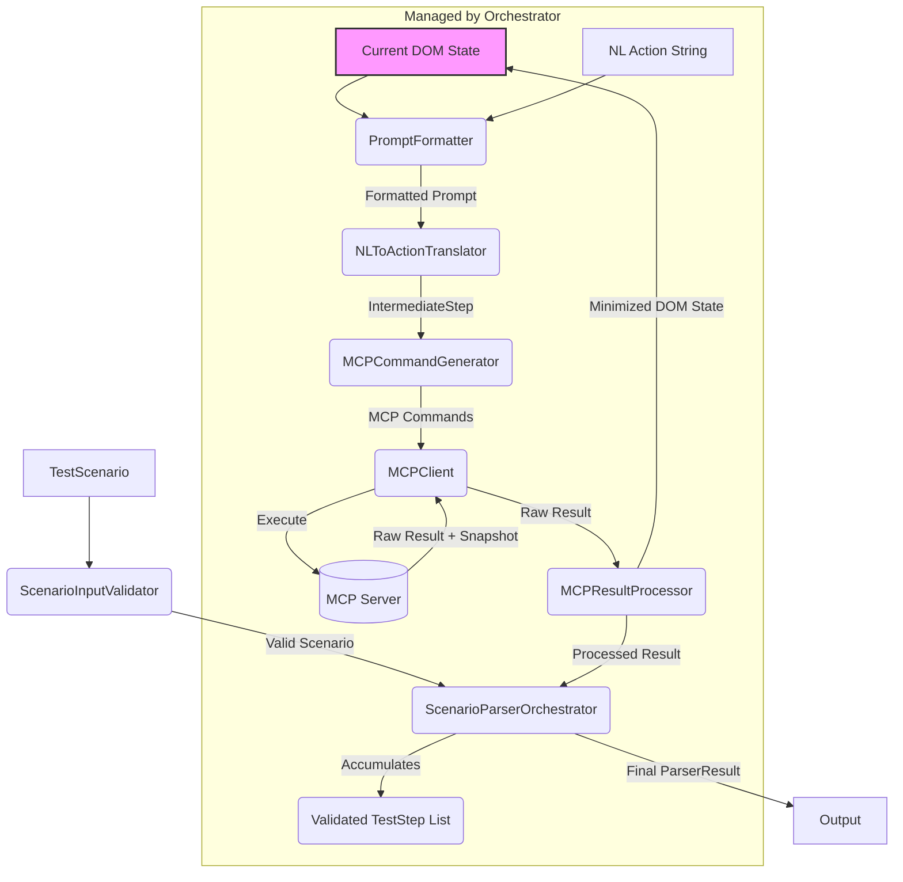

# Scenario Parser Module - Technical Specification

**Version:** 1.0 (MVP)
**Date:** [Current Date]

## 1. Overview

The `scenario-parser` module is responsible for translating a human-readable test scenario (URL + sequence of natural language actions) into a structured sequence of validated `TestStep` objects. It interacts with the `MCP Playwright Server` to execute actions against a live browser environment, uses an LLM to interpret natural language actions within the browser context, and constructs the final steps based on successful execution via MCP.

## 2. Goals (MVP)

*   Accept a `TestScenario` object as input.
*   Interact sequentially with the MCP Playwright Server to perform actions.
*   Utilize an LLM (via function calling) to interpret natural language actions based on DOM context provided by MCP.
*   Filter and serialize the DOM context effectively for the LLM.
*   Generate a list of validated `TestStep` objects for successfully executed actions.
*   Handle errors gracefully during the process.
*   Focus on core actions: `navigate`, `click`, `input`, `assert`.

## 3. Architecture

The module follows a sequential, stateful processing model orchestrated by `ScenarioParserOrchestrator`. Each user action is processed individually, relying on the browser state resulting from the previous action.



## 4. File Structure

```
src/
├── scenario-parser/
│   ├── scenario-parser.service.ts       # Orchestrator - Main logic
│   ├── orchestrator-helpers.ts          # Optional: Helpers for the orchestrator if it gets too large
│   ├── components/                      # Directory for component modules
│   │   ├── validator/
│   │   │   ├── index.ts                 # Exports
│   │   │   └── validator.logic.ts       # Validation implementation
│   │   ├── mcp-client/
│   │   │   ├── index.ts
│   │   │   ├── mcp-client.logic.ts      # Core request/response logic
│   │   │   └── mcp-retry.logic.ts       # Handles retry policy (example split)
│   │   │   └── mcp-error-handler.ts     # Handles error diagnostics (example split)
│   │   ├── result-processor/
│   │   │   ├── index.ts
│   │   │   ├── result-processor.logic.ts # Handles TestStep creation
│   │   │   ├── dom-parser.ts            # Parses raw MCP snapshot -> initial tree
│   │   │   └── dom-filter.ts            # Filters initial tree -> minimized tree
│   │   ├── prompt-formatter/            # << Component directory
│   │   │   ├── index.ts
│   │   │   ├── prompt-formatter.logic.ts # Logic to load templates, format data
│   │   │   ├── dom-serializer.ts        # Converts minimized tree to string (if complex, could be in utils)
│   │   │   └── prompts/                 # << Prompts moved inside component
│   │   │       ├── index.ts             # Optional: Export prompt strings/functions
│   │   │       └── intermediate-step-generation.prompt.md # Example template file
│   │   │       └── ...                  # Other potential prompts if needed
│   │   ├── nl-translator/
│   │   │   ├── index.ts
│   │   │   └── nl-translator.logic.ts   # LLM API interaction & function parsing
│   │   └── command-generator/
│   │       ├── index.ts
│   │       └── command-generator.logic.ts # MCP command generation logic
│   ├── interfaces/                      # Shared interfaces (unchanged)
│   │   └── ...
│   ├── utils/                           # Shared utilities (keep small or split)
│   │   └── index.ts
│   ├── tests/                           # Test structure mirrors components/
│   │   └── ...
│   ├── README.md
│   └── scenario-parser-tech-spec.md
├── ... (Other top-level src modules)
```

## 5. Component Descriptions

*   **`ScenarioInputValidator` (`components/validator/validator.logic.ts`):** Validates the structure and basic constraints of the input `TestScenario` object.
*   **`MCPClient` (`components/mcp-client/mcp-client.logic.ts`):** Handles all HTTP/WebSocket communication with the MCP Playwright Server. Sends commands, receives raw responses/snapshots/errors. Uses helpers (`mcp-retry.logic.ts`, `mcp-error-handler.ts`) for retry logic and error diagnostics.
*   **`MCPResultProcessor` (`components/result-processor/result-processor.logic.ts`):** Creates validated `TestStep` objects from successful results. Uses helpers (`dom-parser.ts`, `dom-filter.ts`) to parse raw MCP snapshot data and filter the DOM tree.
*   **`PromptFormatter` (`components/prompt-formatter/prompt-formatter.logic.ts`):** Loads prompt templates from its local `prompts/` directory. Serializes the minimized DOM (using `dom-serializer.ts` or utils). Injects context (DOM, action, URL) into the template. Constructs the final `LLMPromptPayload` including the function definition for `IntermediateStep`.
*   **`NLToActionTranslator` (`components/nl-translator/nl-translator.logic.ts`):** Receives the `LLMPromptPayload`. Manages the LLM API call, expecting the `IntermediateStep` function call. Parses the LLM response to extract the structured `IntermediateStep` object. Handles LLM API errors.
*   **`MCPCommandGenerator` (`components/command-generator/command-generator.logic.ts`):** Translates the `IntermediateStep` from the LLM into specific MCP Server command JSON objects.
*   **`ScenarioParserOrchestrator` (`scenario-parser.service.ts`):** The main service class. Manages the overall step-by-step flow, maintains the current browser state (DOM representation), coordinates calls to other components (using their `index.ts` exports), handles errors, and aggregates the final `ParserResult`. Uses `orchestrator-helpers.ts` if needed.

## 6. Key Interfaces

*(Located in `src/interfaces/`)*

**`common.types.ts`**

```typescript
export interface ErrorInfo {
  stepId?: string; // ID of the TestStep where error occurred (if applicable)
  message: string;
  action?: string; // User's NL action string
  mcpCommand?: string; // MCP command that failed (if applicable)
  llmError?: string; // Error during LLM interaction
  selector?: string; // Selector involved (if known)
  screenshot?: string; // Base64 encoded PNG (from MCP diagnostics)
  domSnapshot?: string; // Final DOM state string (from MCP diagnostics) // TBD: Format
  stack?: string;
}

export interface OperationResult {
  success: boolean;
  executionTimeMs?: number;
  error?: ErrorInfo;
}
```

**`scenario.types.ts`**

```typescript
import { TestStep } from './test-step.types';
import { ErrorInfo, OperationResult } from './common.types';

export interface TestScenario {
  url: string; // Initial URL to navigate to
  actions: string[]; // List of user's natural language actions
  options?: {
    timeoutMs?: number; // Overall timeout for parsing
    // TBD: Other potential options?
  };
}

export interface ParserResult extends OperationResult {
  testSteps: TestStep[]; // The successfully generated steps
  status: 'success' | 'partial' | 'failed'; // Overall outcome
  errors?: ErrorInfo[]; // Accumulated errors if status is not 'success'
}
```

**`test-step.types.ts`**

```typescript
export type TestStepAction = 'navigate' | 'input' | 'click' | 'assert' /* | 'wait' | 'select' | 'hover' | 'keypress' */; // MVP focuses on first 4

export interface TestStepContext {
  mcpSnapshot: any; // The raw snapshot data returned by MCP for this step // TBD: Define based on MCP API
  // TBD: Other potential context fields? Attempt count, errors during MCP step?
}

export interface TestStep {
  id: string; // Unique identifier (e.g., uuid)
  description: string; // Original user natural language action string
  action: TestStepAction;
  selector?: string; // The specific selector validated and used by MCP
  value?: string | number | boolean; // Value for 'input' or 'assert' actions
  url?: string; // URL for 'navigate' action
  context: TestStepContext; // Snapshot and potentially other data from MCP execution
  // Optional fields for post-MVP:
  // timeout?: number; // Step-specific timeout
  // waitFor?: 'visible' | 'networkidle' | 'domcontentloaded' | 'load';
  // isLastStep?: boolean; // Might be handled by Orchestrator logic
  // maxRetries?: number; // Step-level retries (distinct from MCPClient retries)
}

```

**`mcp.types.ts`**

```typescript
// TBD: Define based on actual MCP Playwright Server API Spec

// Example placeholder for a command
export interface McpCommandBase {
  command: string; // e.g., 'mcp_playwright_browser_click'
  params: Record<string, any>;
}

// Example placeholder for a snapshot result
export interface McpSnapshotResult {
  snapshotData: any; // The raw DOM/Accessibility tree data // TBD
  url: string;
  // TBD: Other metadata? Visibility hints? Interactivity hints? Stable node IDs/selectors?
}

// Example placeholder for a generic success result
export interface McpSuccessResult {
  message: string;
  // TBD: Other data?
}

// Example placeholder for an error result
export interface McpErrorResult {
  errorMessage: string;
  errorCode?: string; // TBD
  diagnostics?: {
      screenshot?: string; // Base64 PNG
      domSnapshot?: string; // TBD: Format
  }
}

export type McpResult = (McpSnapshotResult | McpSuccessResult) & { success: true } | McpErrorResult & { success: false };

```

**`internal.types.ts`**

```typescript
import { TestStepAction, OperationResult } from "."; // Assuming barrel file exports these

// Represents the structured hypothesis from the LLM via function calling
export interface IntermediateStep {
  actionType: TestStepAction | 'unknown'; // Inferred action type
  targetSelector?: string; // Primary candidate selector identified by LLM
  inputValue?: string | number | boolean; // Value for input/assert
  description: string; // Original NL action description
  isAmbiguous?: boolean; // Flag if LLM detected ambiguity (e.g., multiple targets)
  confidenceScore?: number; // Optional: LLM confidence (0-1)
  // TBD: Optional alternativeSelectors?: string[];
  error?: string; // Error during translation (e.g., unknown action)
}

// Represents a node in the filtered, serializable DOM tree passed to the LLM
export interface SerializableDOMNode {
  tag: string; // e.g., 'button', 'input', 'a', 'div'
  attributes: Record<string, string>; // Key-value map of *relevant* attributes (id, class, data-*, aria-*, role, type, placeholder, value, etc.)
  text: string; // Direct text content, potentially truncated or concatenated from children text nodes
  mcpSelector: string; // The stable selector/identifier provided by MCP for this node (e.g., XPath, unique attribute)
                       // TBD: Exact format depends on MCP Server API capabilities.
  children: SerializableDOMNode[]; // Child nodes that are also visible/interactive
  isVisible: boolean; // Based on MCP hint
  isInteractive: boolean; // Based on MCP hint (e.g., clickable, focusable, inputtable)

  /**
   * Converts this node and its relevant children into a concise string
   * representation suitable for inclusion in an LLM prompt.
   * Example: `[xpath-selector]<button id='login' class='btn'>Login</button>`
   * @returns {string} String representation of the node.
   */
  toString(): string;
}

// Context passed to the PromptFormatter for generating the LLM prompt
export interface BrowserStepContext {
  minimizedDOM: SerializableDOMNode; // The filtered DOM tree
  currentURL?: string; // Only included for navigation or first step
  previousStepResult?: OperationResult; // Result of the immediately preceding step
}
```

## 7. Core Function Signatures

*(Illustrative examples, reflecting potential splits and updated paths)*

**`scenario-parser.service.ts`**

```typescript
import { TestScenario, ParserResult } from './interfaces';
// Import component facades/main functions from './components/...'

export class ScenarioParserOrchestrator {
  // Dependencies injected via constructor

  async parse(scenario: TestScenario): Promise<ParserResult>;
}
```

**`components/validator/validator.logic.ts`**

```typescript
import { TestScenario } from '../../interfaces';

// Throws ValidationError on failure
export function validateScenarioLogic(scenario: TestScenario): void;
```

**`components/mcp-client/mcp-client.logic.ts`**

```typescript
import { McpCommandBase, McpResult } from '../../interfaces';
// import { handleRetry } from './mcp-retry.logic';
// import { handleMcpError } from './mcp-error-handler';

export class MCPClientLogic {
  // Constructor to setup connection details

  async executeCommandLogic(command: McpCommandBase): Promise<McpResult>; // Core execution, calls retry/error handlers
}
```

**`components/result-processor/result-processor.logic.ts`**

```typescript
import { McpResult, SerializableDOMNode, IntermediateStep, TestStep } from '../../interfaces';

export class ResultProcessorLogic {
  createTestStepLogic(mcpResult: McpResult, intermediateStep: IntermediateStep, newDomState: SerializableDOMNode): TestStep;
}
```

**`components/result-processor/dom-parser.ts`**

```typescript
import { McpSnapshotResult, SerializableDOMNode } from '../../interfaces';

export function parseSnapshotToDOMTree(snapshotResult: McpSnapshotResult): SerializableDOMNode; // TBD: Needs exact MCP snapshot format
```

**`components/result-processor/dom-filter.ts`**

```typescript
import { SerializableDOMNode } from '../../interfaces';

export function filterDOMTree(domTree: SerializableDOMNode): SerializableDOMNode; // Returns the minimized tree
```

**`components/prompt-formatter/prompt-formatter.logic.ts`**

```typescript
import { BrowserStepContext, IntermediateStep } from '../../interfaces';
import { LLMPromptPayload, LLMFunctionDefinition } from 'some-llm-sdk'; // Placeholder
// import { serializeDOMTreeToString } from './dom-serializer'; // Or from utils

export class PromptFormatterLogic {
  // Load prompt template during initialization

  getFunctionDefinitionLogic(): LLMFunctionDefinition; // Defines IntermediateStep structure
  formatPromptLogic(context: BrowserStepContext, userAction: string): LLMPromptPayload; // Uses template + context
}
```

**`components/nl-translator/nl-translator.logic.ts`**

```typescript
import { IntermediateStep } from '../../interfaces';
import { LLMPromptPayload } from 'some-llm-sdk'; // Placeholder

export class NLToActionTranslatorLogic {
  // Constructor takes LLM client instance

  async translateLogic(promptPayload: LLMPromptPayload): Promise<{ step?: IntermediateStep; error?: string }>; // Calls LLM, parses function call
}
```

**`components/command-generator/command-generator.logic.ts`**

```typescript
import { IntermediateStep, McpCommandBase } from '../../interfaces';

export class MCPCommandGeneratorLogic {
  generateCommandsLogic(intermediateStep: IntermediateStep): McpCommandBase[];
}
```

**`utils/index.ts`**

```typescript
import { SerializableDOMNode } from '../interfaces';

// Potentially move dom-serializer logic here if broadly useful
export function serializeDOMTreeToString(node: SerializableDOMNode): string;
// Other utility functions...
```

## 8. High-Level Flow Recap

1.  **Validate:** `ScenarioParserOrchestrator` uses `ScenarioInputValidator`.
2.  **Navigate:** `Orchestrator` -> `MCPCommandGenerator` (for navigate) -> `MCPClient` -> MCP Server.
3.  **Get Initial State:** `MCPClient` returns snapshot -> `MCPResultProcessor` parses/filters -> `Orchestrator` stores initial DOM state.
4.  **Loop through `actions`:**
    a.  **Format Prompt:** `Orchestrator` gives current DOM, action string -> `PromptFormatter` creates LLM payload with function def.
    b.  **Translate:** `Orchestrator` -> `NLToActionTranslator` -> LLM API. Receives `IntermediateStep`.
    c.  **Generate MCP Command:** `Orchestrator` -> `MCPCommandGenerator` -> MCP Command(s).
    d.  **Execute MCP Command:** `Orchestrator` -> `MCPClient` -> MCP Server. Receives raw result (success+snapshot or error+diagnostics).
    e.  **Process Result:** `Orchestrator` -> `MCPResultProcessor`.
        *   On Success: Generate `TestStep`, parse/filter *new* DOM state. Update Orchestrator's state. Add `TestStep` to list.
        *   On Failure: Record `ErrorInfo`. Terminate loop.
5.  **Finalize:** `Orchestrator` compiles `ParserResult` with accumulated `TestStep` list and status/errors.

### 8.1. State Management and Data Flow within the Step Loop

The core of the process relies on maintaining the correct browser state between steps. Here's a breakdown of how the DOM state flows during the loop processing (Step 4 in the recap):

1.  **Initiate Step N:** The `ScenarioParserOrchestrator` starts processing the Nth user action string. It retrieves the **current minimized DOM state** (`SerializableDOMNode` tree) that was stored after the successful completion of step N-1 (or the initial navigation).
2.  **Format Prompt (Step 4a):** The `Orchestrator` creates a `BrowserStepContext` containing this current minimized DOM state and passes it, along with the Nth action string, to the `PromptFormatter`.
3.  **Translate & Generate (Steps 4b, 4c):** The `NLToActionTranslator` interprets the action within the provided DOM context, and the `MCPCommandGenerator` creates the necessary MCP command(s).
4.  **Execute Step N (Step 4d):** The `Orchestrator` instructs the `MCPClient` to execute the command(s) for step N.
5.  **Receive Result (Step 4d):** If the MCP execution is successful, the `MCPClient` receives a result from the MCP Server which includes the **raw snapshot data** representing the browser state *after* action N was performed.
6.  **Process Result (Step 4e):** The `Orchestrator` passes this raw result to the `MCPResultProcessor`.
7.  **Update DOM State (Step 4e):** The `MCPResultProcessor` (using `dom-parser.ts` and `dom-filter.ts`) parses the new raw snapshot data into a **new `SerializableDOMNode` tree** and filters it to create the **new minimized DOM state**.
8.  **Store New State & TestStep (Step 4e):** The `MCPResultProcessor` returns the validated `TestStep` object for step N *and* the **new minimized DOM state** back to the `Orchestrator`. The `Orchestrator` adds the `TestStep` to its list and **updates its internally stored state** to hold this new minimized DOM representation.
9.  **Prepare for Next Step:** When the `Orchestrator` begins step N+1, it repeats from point 1, using the minimized DOM state captured and stored at the end of step N.

This ensures that each step's interpretation by the LLM is always based on the state of the browser resulting from the successful execution of the previous step.
